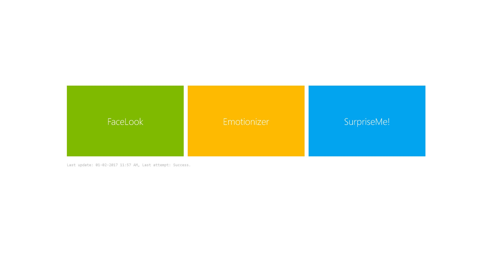
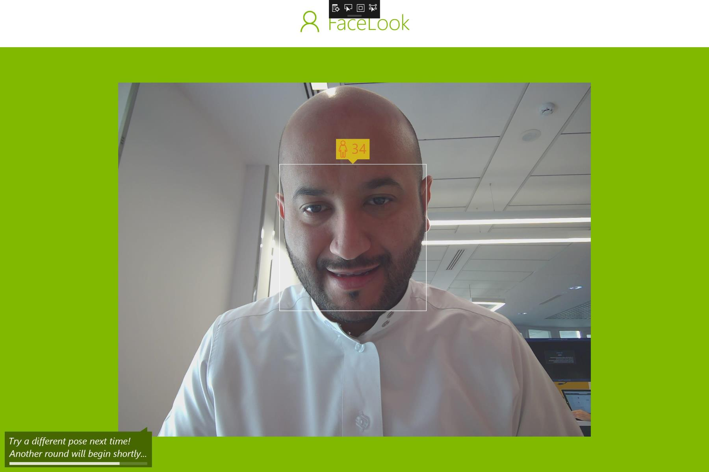

## What is Cognitive Services Showcase Demo

This demo focuses on showing how to integrate and use Microsoft [Cognitive Services](https://www.microsoft.com/cognitive-services/en-us/). The demo has been built entirely using [Kiosk project](https://github.com/Microsoft/Cognitive-Samples-IntelligentKiosk) which is a UWP App and it consists of three main scenarios/screens. 




#### General Pre-requisites

In order to run all the scenarios in this project, you need to do the following

- Replace the Cognitive Services Face API key with your own, you can find it in `FaceServiceHelper.cs`:

```csharp
private static string apiKey = "<<YOUR Face API Key>>";

```


- Replace the cognitive Services Emotion API key with your own, you can fid it in `EmotionServiceHelper.cs` :

```csharp
private static string apiKey = "<<Your Emotion API Key>>";

```

To get new key, subscribe to Cognitive Services [from here](https://www.microsoft.com/cognitive-services/en-US/sign-up?ReturnUrl=/cognitive-services/en-us/subscriptions)

- Upload `SyncedSettings.xml` file which you will find in the root of this project to your website and then modify following line of code which you will find in both `ShoppingGamePage.xaml.cs` and `StartPage.xaml.cs` 

```csharp
HttpRequestMessage request = new HttpRequestMessage(HttpMethod.Get, new Uri("<<URL TO Your SyncedSettings.xml>>"));

```

The idea here is that we don't want the app settings to be at the app level because you might want to run this app in Kiosk mode and it will be hard to open the app and modify all the settings in the XML file and redeploy.


- If you want to use the email sending feature in Emotionizer sceanrio, you need to [subscribe to SendGrid] (https://docs.microsoft.com/en-us/azure/app-service-web/sendgrid-dotnet-how-to-send-email) service from Azure portal then modify the following code in `EmotionsGamePage.xaml.cs` to include your credentials: 

```csharp
var apiUserContent = new StringContent("<<API USER>>"); 
..
..
var apiKeyContent = new StringContent("<<API Password>>");

```


#### FaceLook

This scenario is basically using the famous [Face API](https://www.microsoft.com/cognitive-services/en-us/face-api) to detect the user age and gender, the camera in this scenario and is always on waiting for a face to appear to capture it. Once the face captured the app will send the image to Facep API through this piece of code: 

```csharp
this.DetectedFaces = await FaceServiceHelper.DetectAsync(
                        await this.GetImageStreamCallback(),
                        returnFaceId: true,
                        returnFaceLandmarks: false,
                        returnFaceAttributes: detectFaceAttributes ? DefaultFaceAttributeTypes : null);
```

If you want to trace the logic of this scenario, it is in `AutomaticPhotoCapturePage.xaml` and the code-behind of this page. I leave you with some sample usage of this scenario:


*AI made me 1 year older*


 
#### Emotionizer 

This an entirely new scenario (not exist in the original Kiosk project) which is fun and addictive and at the same times shows how you can utilize Emotions API to build fun games. Emotionizer is a game where two people have to face the camera in order for the game to start, the game then will ask the users to show an emotion (Sad, Happy, Angry, Neutral or Surprised), once the count down finished, the game will take a picture of the two faces and send to the Emotion API and the reults will be returned to decided who is the winner (who perfected the emotion more)  :)

After the results appeared, the players have the options to play again or send the results to an email of thier choice. This is the code snippet responsible for sending the email which you might want to change:

```csharp
await new E().SendEmail(new Areas.EmailMessage
                {
                    ToEmail = emailAddress,
                    To = emailAddress,
                    Subject = "Your Emotionizer Result!",
                    Body = "Hi,\nThanks for taking the time and trying Emotionizer game at Microsoft Arabia office. Emotionizer game is built using Cognitive Services, an API - based service that allow you to bring the power of AI and Machine Learning into your App. Learn more here: https://www.microsoft.com/cognitive-services.\n\n Attached you will find your result.\nRegards,",
                    From = "Microsoft",
                    FromEmail = "no-reply@mydomain.com",
                    Attachments = new ReadOnlyCollection<StorageFile>(new List<StorageFile> { { imgFile } })
                });

```

You can trace the logic of this scenario in `EmotionsGamePage.xaml.cs` the majority of this scenario logic exists in this single file.

##### TBD : PICS SAMPLES


#### SurpriseMe
Straightly taken from the original Kiosk Project but with some modifications to enhance the UI and the logic, this scenario is designed to use the user age & gender and suggest some products for him/her. It is a fun use of the Face API which can be implemented as Kiosk in shopping malls or stores to suggest some products based on the user age group and gender, also this scenario can suggest prodcts if more than one person appear on the picture.

The defintion of the products per age/gender group are placed in SyncedSettings.xml file which as we mentioned in the pre-requisites has to be placed in an external website. This is sample of how the defintion is set in the XML file:

```xml
<Recommendation Url="http://saudi.souq.com/sa-en/minecraft-by-microsoft-for-xbox-one-xbox-one-13466600004/u/" Id="MaleYoungerThan12"/>

<Recommendation Url="http://saudi.souq.com/sa-en/project-spark-by-microsoft-for-xbox-one-xbox-one-14644700004/u/" Id="FemaleYoungerThan12"/>


<Recommendation Url="http://saudi.souq.com/sa-en/microsoft-xbox-one-1tb-console-with-the-division-game-+-3-months-live-gold-membership-+-gears-of-war-ultimate-edition-4048900006/u/" Id="ChildWithOneOrMoreAdults">

```

In this scenario, all what you might need to do is to replace the URLs of the products to those that fits your business or maybe add/modify the age/gender groups.

##### TBD : PICS SAMPLES


