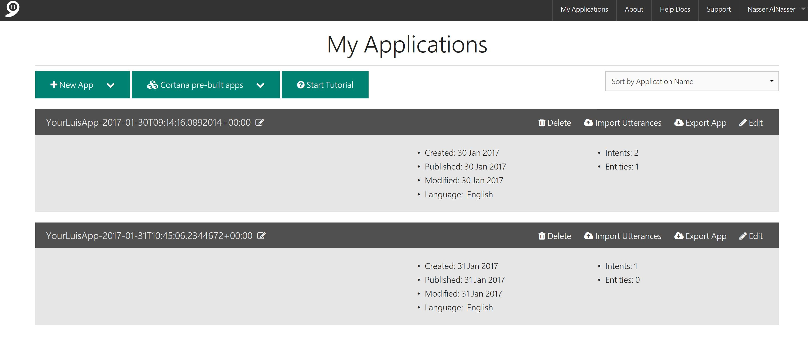

## Personalized Meme Bot

Because Bots are fun to build, I thought to make this demo also fun to use. Simply it is a bot that will take your name and will return a meme image personalized with your name. Since there are tons of demos showing how to build a bot using the default way (Visual Studio template), I am going to build this demo using Azure Bots Service, a service that is still in preview but it is good enough to build fully functional bots.


### Create the workspace

- Go to Azure portal, hit the + icon, choose Intelligence + analytics and then Bot Service (preview)


- Fill in the bot website details. This is where the code of the bot will be hosted. It is an App Service at the end :)


- Create Microsoft App ID. This is needed to authenticate your bot with Microsoft bot framework. Just click the blue botton and follow the instructions. Make sure to copy the generated password before you return to Azure screen.


- Choose a language and template. Currently C# and Node.js are supported. There are 5 different templates to choose from depending on the scenario. In our case we will use Language Understanding where we will be creating a project in the Language Understanding Intelligent Service (LUIS). So choose C# and Language Understanding and hit Create bot. 


- It will ask you to sign in to Language Understanding Intelligent Service (LUIS), use your Microsoft account (@hotmail/@outlook) to create a LUIS app. We will get into what LUIS is exactly later in this demo. For now complete the steps in this pop-up screen until you returned to Azure portal.


-   After waiting for some time Azure will start creating your bot workspace. This might take several minutes.


-  Congrats, you now have a bot service and a full workspace to develop, configure and publish your bot.


###  Language Understanding Intelligent Service (LUIS)

LUIS is one of [Microsoft Cognitive Services](https://www.microsoft.com/cognitive-services/en-us/) which is specialized in understanding natural language and the context of the sentence. This allow you to create bots that can have a dialog with the user and understand the intent of each sentence. 

Our simple demo can actually be built without LUIS, but I am brining LUIS to the picture to demonstrate a very simple usage of this powerful tool.  Now let's head directly to LUIS portal.

- Go to [LUIS.ai](http://luis.ai) and sign-in using your account that you've just used to create LUIS project. You will see a list of your LUIS apps, which include the one Azure created for you when you created your bot service at previous step.



-  Now click on the app name to start training your app to understand certain phrases and build your intent and entities.


- Creat new intent by clicking on the + sign next to `Intents` in the left side menu. The intent we are going to create is `NameReceived` . We will provide one sentence as an example of this intent. Later we are going to add more variations that lead to the same intent. Here we are telling LUIS whenever you recieve similar phrases then they belong to this intent `NameReceived`.


- Add new entity and name it `Name` , this will help us identify which part of the phrase exactly is the name. We will train the model to identify the intent and the entity.


- Now think about how your bot users will talk to it? One will say "My name is John" , the other will say "I am John", another one will say simply "John". Write all these utterances and select which part of the phrase is the `Name` entity by clicking on it (it will get highlighted) then choose from the drop down the intent `NameReceived`.


- Once you are done from entering some utterances, hit the train button in the bottom left corner. This will train your model on whatever you enter. Your LUIS model will be smarter :)


- After entering as many utterances as you can and training your app, you are ready to publish it. Click on the publish button at the top left and then hit update published application.


### Develop your bot on Azure Bot Service

Now let's go back to Azure portal and continue from where we left everything in the first step. 

- In `run.csx` file, notice this piece of code:

```csharp
case ActivityTypes.Message:
                    await Conversation.SendAsync(activity, () => new BasicLuisDialog());
                    break;
```

Here we are telling our bot to call `BasicLuisDialog()` whenever a message is recieved. This is a separate class provided by the template itself which will contain all the logic to process the messages based on thier intents.

- Now go to `BasicLuisDialog.csx` file. Add these couple of lines at the top:

```csharp
using System.Collections.Generic;
using Microsoft.Bot.Connector;
```


- Now replace this code:

```csharp
 [LuisIntent("MyIntent")]
    public async Task MyIntent(IDialogContext context, LuisResult result)
    {
        await context.PostAsync($"You have reached the MyIntent intent. You said: {result.Query}"); //
        context.Wait(MessageReceived);
    }
```


with this

```csharp
  [LuisIntent("NameReceived")]
    public async Task NameIntent(IDialogContext context, LuisResult result)
    {
        var replyMessage = context.MakeMessage();
        var entity = result.Entities.SingleOrDefault(e => e.Type == "Name");

            // The Attachments property allows you to send and receive images and other content
            replyMessage.Attachments = new List<Attachment>()
            {
                new Attachment()
                {
                    ContentUrl = $"http://belikebill.azurewebsites.net/billgen-API.php?default=1&name={entity.Entity}",
                    ContentType = "image/jpg",
                    Name = "Meme.jpg"
                }
            }; 
            
       
       await context.PostAsync(replyMessage);
       await context.PostAsync($"Enough about: {entity.Entity} , give me a new name :)"); //
        context.Wait(MessageReceived);
        
    }
}

```


Let's discuss what we have done here. This function `NameIntent` will be called only if the intent discovered by the LUIS is `NameReceived`. In this function we are extracting the entity by this line of code (which is the individual name):

```csharp
        var entity = result.Entities.SingleOrDefault(e => e.Type == "Name");
```

Then we are preparing the media attachment to be sent back to the user using an [BeLikeBill API](http://belikebill.azurewebsites.net/billgen-API.php) and passing the identified name to the API.

```csharp

new Attachment()
    {
        ContentUrl = $"http://belikebill.azurewebsites.net/billgen-API.php?default=1&name={entity.Entity}",
        ContentType = "image/jpg",
        Name = "Meme.jpg"
    }
```

finally we send the message back to the user

```csharp
await context.PostAsync(replyMessage);
await context.PostAsync($"Enough about: {entity.Entity} , give me a new name :)"); //
context.Wait(MessageReceived);
```


So to make sure you have everything right, I am here pasting the full code for `BasicLuisDialog` :

```csharp
using System;
using System.Threading.Tasks;
using System.Collections.Generic;
using Microsoft.Bot.Connector;
using Microsoft.Bot.Builder.Azure;
using Microsoft.Bot.Builder.Dialogs;
using Microsoft.Bot.Builder.Luis;
using Microsoft.Bot.Builder.Luis.Models;

// For more information about this template visit http://aka.ms/azurebots-csharp-luis
[Serializable]
public class BasicLuisDialog : LuisDialog<object>
{
    public BasicLuisDialog() : base(new LuisService(new LuisModelAttribute(Utils.GetAppSetting("LuisAppId"), Utils.GetAppSetting("LuisAPIKey"))))
    {
    }

    [LuisIntent("None")]
    public async Task NoneIntent(IDialogContext context, LuisResult result)
    {
        await context.PostAsync("I am a bot that expect a name, please enter a name :)"); //
        context.Wait(MessageReceived);
    }

    // Go to https://luis.ai and create a new intent, then train/publish your luis app.
    // Finally replace "MyIntent" with the name of your newly created intent in the following handler
    [LuisIntent("NameReceived")]
    public async Task MyIntent(IDialogContext context, LuisResult result)
    {
        var replyMessage = context.MakeMessage();
        var entity = result.Entities.SingleOrDefault(e => e.Type == "Name");

            // The Attachments property allows you to send and receive images and other content
            replyMessage.Attachments = new List<Attachment>()
            {
                new Attachment()
                {
                    ContentUrl = $"http://belikebill.azurewebsites.net/billgen-API.php?default=1&name={entity.Entity}",
                    ContentType = "image/jpg",
                    Name = "Meme.jpg"
                }
            }; 
            
       
       await context.PostAsync(replyMessage);
       await context.PostAsync($"Enough about: {entity.Entity} , give me a new name :)"); //
        context.Wait(MessageReceived);
        
    }
}
```


- Try your bot in the chat window on the right side, you should be getting a result similar to this:


### Your Bot is Ready !

[Add To Skype]: https://dev.botframework.com/Client/Images/Add-To-Skype-Buttons.png
[Skype Link]: https://join.skype.com/bot/c8197ccf-361d-4a62-987b-32c819edf775


That is it! Your bot is now ready to be used by the public. You can actually use mine from:

1. **[Web Chat](http://thebackend.azurewebsites.net/memebot/index.html)**
 
2. [![Add to Skype][Add To Skype]][Skype Link]


You can publish your bot to the bot directory to allow everyone to discover it by going through the straightforward steps in the Publish tab. But your bot by now is actually published on the web and accessible by any one who has the link which you can obtain from Channels tab.


