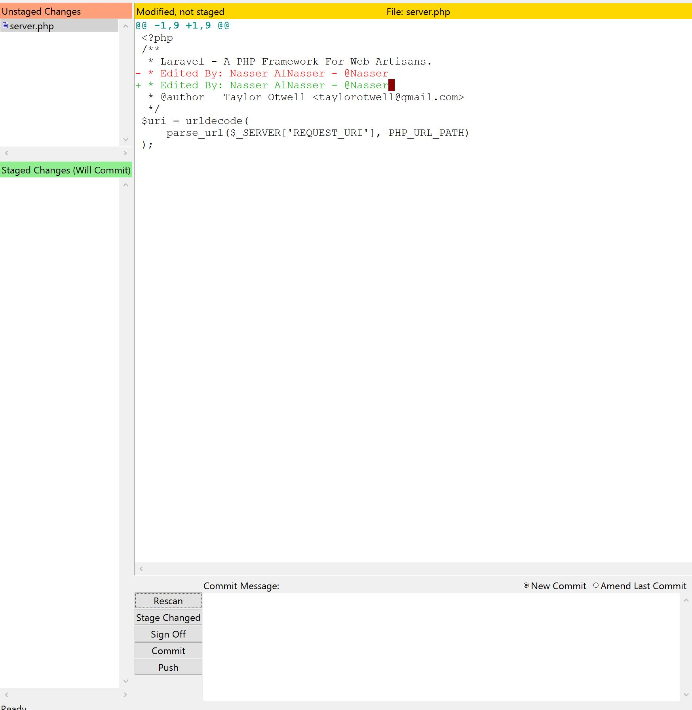
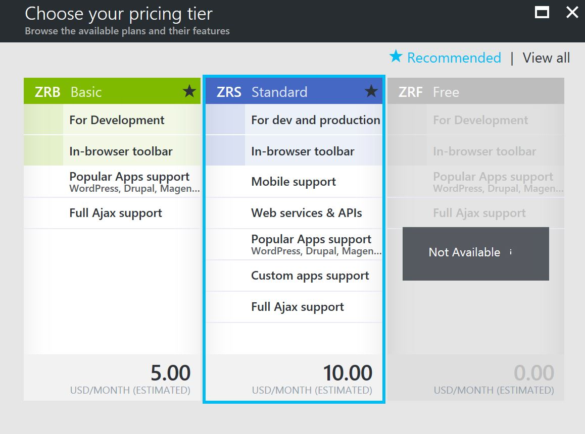
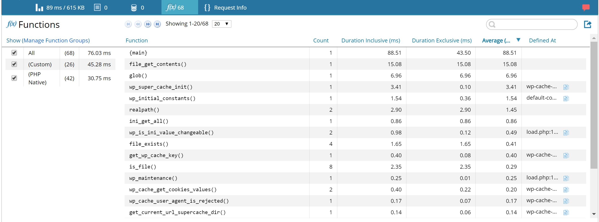

## Build PHP Dev Environment with Azure and Visual Studio Code 

If you are a PHP developer, like me, you know how difficult it is to build solid and clean development environment. In this demo we will show how can you create a fully integrated PHP development that covers many DevOps scenarios suhc as:

- Coding with autocomplete and highlighting
- Live and local debugging capabilities.
- Integrating with Git/GitHub for code publishing and syncronization. 
- Continious Deployment to a cloud-based web site.
- A/B Testing for quality and performance
- Site slots to manage different environments (Prod, Staging, Dev, Test .. etc)
- etc ....

So in this demo we will try to cover most of these points either in details or just mentioning it with an external reference for the full details. 

### 1. Visual Studio as a Code Editor

Now let's chose your code editor, the place where you are going to spend most of your time as a developer in. Microsoft announced Visual Studio code as free cross-platform code editor, and since it's release it picked up huge interest from the developers communities. Visual Studio Code has great PHP support including code highlighting and autocomplete with many extension that you can install to add extra capaibilities.

- [Download Visual Studio Code](https://code.visualstudio.com/) : Wither you are running Windows, Linux, or Mac. Chose your VS Code and install it.
- [Watch Introductory Videos](https://code.visualstudio.com/docs/introvideos/overview) : Watch these short videos to familiarize yourself with the environment.

Now you have Visual Studio Code installed and you know some of the basics. Let's move on to the next step to configure it for you Mr. PHP Developer.


### 2. Setup VS Code as PHP Development Environment

Visual Studio Code is a great editor for PHP development. You get features like syntax highlighting and bracket matching, IntelliSense (code completion), and snippets out of the box and you can add more functionality through community created VS Code extensions.

There are many PHP language extensions available on the [VS Code Marketplace](https://marketplace.visualstudio.com/VSCode) and more are being created. You can search for PHP extensions from within VS Code by running the **Extensions: Install Extension command** (`Ctrl+Shift+P` and type `ext install`) then filter the extensions drop down list by typing `php`.

There are many PHP extenstions to chose from and they are  all created by the community, for example if you work Laravel you might want to install `Laravel Blade Snippets`. But for the sake of this demo, I want to recommend some general and very popular extenstions to install:

- [PHP Debug](https://marketplace.visualstudio.com/items?itemName=felixfbecker.php-debug): `ext install php-debug`
- [Code Runner](https://marketplace.visualstudio.com/items?itemName=formulahendry.code-runner) : `ext install code-runner`
- [PHP IntelliSense](https://marketplace.visualstudio.com/items?itemName=felixfbecker.php-intellisense): `ext install php-intellisense`

You can click on the links above to read the installation steps and requirements for each extenstion. Once you did this you are ready to move to the next step.

##### Snippets

Visual Studio Code includes a set of common snippets for PHP. To access these, hit `Ctrl+Space` to get a context specific list.


##### Linting

VS Code uses the official PHP linter (php -l) for PHP language diagnostics. This allows VS Code to stay current with PHP linter improvements.
There are three settings to control the PHP linter:
- `php.validate.enable`: controls whether to enable PHP linting at all. Enabled by default.
- `php.validate.executablePath`: points to the PHP executable on disk. Set this if the PHP executable is not on the system path.
- `php.validate.run`: controls whether the validation is triggered on save (value: `"onSave"`) or on type (value: `"onType"`). Default is on save.

To set the PHP executable path, open your User or Workspace Settings and add the `php.validate.executablePath`:

```json
{
    "php.validate.executablePath": "c:/php/php.exe"
}
````


### 3. Debugging PHP through VS Code

One of the extenstions we installed in the previous step is [PHP Debug](https://marketplace.visualstudio.com/items?itemName=felixfbecker.php-debug) which provides the ability to debug PHP code right from VS code (no more echo / print commands :) ) . Follow the steps mentioned in the extenstion page and configure it properly, it will require installing and configure XDebug and enabling remote debugging in php.ini, a lengthy process but it worth the effort.

1.  Go to your PHP project (You have to open a complete PHP project/folder, not a single PHP file) then hit the Debug icon on the left side menu:


2. Click on the gear icon to open the launch.json which will allow you to configure the debugging settings for this project. Make sure it looks like this:


Note: The port should match the one you confugured in `php.ini` , for me I configured it as 9123. 

3. Now hit the green launch button.

4. Open your PHP script through the browser.

5. Now you will see VS Code going through your PHP execution line by line and trace variables output or any warnning/erros on the side. 


6. You can use the control bar on the top to move the execution of your code as required


7. Notice that you can define whatever you want to trace in your debugging session through this section:


### 4. Connect your PHP project to Git/GitHub

You can easily connect your PHP (or whatever) project in VS code to your local Git or GitHub account to sync your code and keep track of your system's versions and changes.

##### Connect to local Git

First, you need to have [Git](https://git-scm.com/download) installed on your machine, make sure you install version 2.0 at least. For more information on how to properly install and configure Git, [visit this page](https://www.atlassian.com/git/tutorials/install-git#windows).

- Now in your PHP project in Visual Studio Code, click on the Git icon on the left and then click on "Initialize git repository".

- To commit all the project files to your master branch, write a comment and click the commit icon on the top as per the following screenshot:

- To confirm that changes are synced properly, try to change any line of code on any file of your project, save the change but don't do any commit from the visual studio code itself. Open Git Gui application (search for it in Windows search bar). Once Git Gui is opened, open the project repository (navigate to the project directory in your system)

- Now in Git Gui you should see the change you made in visual Studio Code, if you don't press rescan.



- Congrats, you have Visual Studio code connected to your local git.


##### Connect to GitHub

Now you have VS Code connected to local git, all what you need to do to push your code to GitHub repo are the following steps:

- Install [GitHub Desktop](https://desktop.github.com/)
- Open GitHub Desktop and login using your GitHub account.
- Add your local PHP project which you have just initalized on local git to GitHub Desktop.

- Now click on Publish and set the GitHub repo you want to create for this project.

- Once you have done this and go back to your VS code and do any change you will find that a new sync icon appeared in the bottom bar which indicate the ability to sync your changes to the remote repo (GitHub).


That's all. By reaching to this point, you now have a full local PHP development environment equipped with IntelliSense, Debugging, Git and GitHub syncing. Now let's connect all of that to the cloud and utilize Azure DevOps capbilities.

### 5. Continuous  Deployment on Azure Web Apps

Let's start by setting up a Continuous Deployment process between our GitHub repo we've just created and our Azure Web App. If you don't know how to create a website on Azure, please [watch this video](https://docs.microsoft.com/en-us/azure/app-service-web/app-service-web-overview). Next steps are assuming you already have a website on Azure:

- From the your web app menu on Azure Portal, select "Deployment Options"


- Click on Choose Source then chose GitHub.
- You will be asked about your GitHub account credentials just for the first time.
- Once you link your GitHub account, you will go back to the deployment options blade to complete the configuration.
- You will be asked about the repository you want to link to this website and which branch, if this is your production website then most probably you will link it to the master branch. I am here deployment a PHP script from my personal repo which generates Captch images and validate the user entry against it.


- Now click OK to set up the connection between your website and your GitHub account.

- If you go back to overview blade, you should see the GitHub project link in the information:


- Also I found that Azure automatically pulled my code and deploy it to my website for me.


That's it, now everytime I push a new code change to my master branch through VS code (or any other code editor) and commit these changes they will get deployed automatically to my Azure website. Sure you are asking yourself now, this is not a good practice in production website, you need to make sure that your code running smoothly in a pre-production environment first, sure, that is what we are going to see later in this Demo :)


### 6. Site Slots for Managed Deployment & Testing

As discussed in the previous point, you don't want to push your code directly to a production environment without doing some UAT / Performance testing on pre-prod / testing / staging (name it as you like) environment. So how to create one on Azure and connect it to the same (or different) repo on GitHub?

- Click on Deployment slots from the menu then click on Add Slot.


- Name the slot (I named it here staging) then chose wither you want to copy your production settings. Note that this will copy the settings only, not the code.


- Notice that Azure now created for your an entirely new website with all it is bells and whistles, the website has it's own subdomain (`your_production_name-slot_name`)


- Now connect this website to your deployment source as we did in the previous point (#5 Continious Deployment). You might find it useful to connect it to a new branch from your GitHub account (I connected it here to my `beta` branch)


- Now imagine that you have deployed everything on the staging environment and you are full satisfied with the new release. You have two options to move this release to production: 

1.  Either you push the code to the master branch which is connected as a deployment source for your production website, in this case you have to treat the master branch as you treat your production website, no single commit should be made to this branch until it has been thoroughly tested on the staging environment from the beta bramch (naming as per my example)

2. Or, you simply use the Swap option in the site slots, which will make your staging website production and your production the staging. To do ths simply go to Site Slots and click on Swap button on top.


Follow the instruction on the screen and here you go, your new release became production.


### 7. Run performance testing for your PHP website

If you would like to run a performance test on your website to make sure the performance is up to expectations, you can use the performance testing feature on Azure Web Apps.

- Under Development Tools section in the menu, click on Performance test then click Set account.


- Fill in the details on this screen, if you don't have Team Services account, create one from this screen. It is free.


- Now when you return to the Performance test section, click `New`

- In this page you will have to identify the test details:

1. Test Type: Chose `Manual` if you want to test single URL, if you want to test multiple URLs, chose `Visual Studio Web test`. [Click here](http://docs.telerik.com/fiddler/Save-And-Load-Traffic/Tasks/VSWebTest) for more information on how to create the file for Visual Studio Web test using Fiddler.

2. Name: Give this performance testing a name.

3. GENERATE LOAD FROM: Select the region of the world where the traffic will be coming from. This will help you in identifying any potential delays. 

4. USER LOAD: number of users to simulate the traffic (as if this number of users are accessing the website at the same time)

5. DURATION: For how long the test should continue running.

6. Click Run Test.


- Once your test is done, you will get the results which includes the response time, CPU and Memory Utilization, HTTP status and much more.


### 8. A/B Testing (Testing in production)

A common scenario all website developers are facing, your website is working fine in the test environment and passing your QA test. But once deployed in production problems start appearing, which result in a very hectic rollback process. In Azure Web Apps you can run A/B testing to ensure that your new release is not going to suffer from unexpected issues by routing defined percentage from your production traffic to your staging / pre-prod environment.

This feature in Azure known as "Testing in production" and to use it, follow these steps:

- Under Development Tools section in the menu, click on "Testing in production".


- Chose the deployment slot that you want to share the production traffic with, in my case it is the staging slot I created earlier.
- Set the percentage that you want the staging environment to take out of the production traffic, in my case I set it to 20%. Which leave 80% of the traffic going to the regular production environment.


- Click save.

That is it, now 80% of your traffic will go normally to your production website, and 20% to the staging which contains the new release where you can monitor closely to make sure that  the release you are about to publish have no issues using real usage from real users.


### 9. PHP Debugging using Zend Z-Ray

Debugging your code on Visual Studio Code is something, and debugging your code live on production is something entirely different. In this section we will show how you can enable PHP Debugging for your website from the portal itself and using Zend Z-Ray to do live debugging based on the real usage of the website.

- From the menu, chose PHP Debugging which you can find under Development Tools section


- Chose Enable Z-Ray for Azure

- Chose the plan you prefer, in my case I chose the standard plan.



- Complete the purchase step and you will get this service enabled instantly.

- To access Z-Ray dasboard, go this url `https://<WebsiteName>.scm.azurewebsites.net/ZendServer/` where `<WebsiteName>` is your website name.

- Now enjoy the amount of details about your PHP system, things such as the SQL queries, the execution time for each page, the call stack, the variables values .. etc.





- As you might expect from such service, it might have noticable impact on the execution performance. So enable it only when you want to debug a certain behavior or in a testing/development environment, you can disable it by going to Access Mode and chose Disable. 


### 10. Summary and Resources

Now as a PHP Developer you have all what it takes to develop, debug, control, continiously deploy, monitor and scale your PHP system starting from your development machine reaching to highly scalable cloud-based production environment. If you need me to deep dive in any of the previous point, please feel free to contact me on Twitter (@Nasser)


##### Resources:

- [Configure PHP in Azure App Service Web Apps](https://docs.microsoft.com/en-us/azure/app-service-web/web-sites-php-configure)
- [PHP Programming in VS Code](https://code.visualstudio.com/Docs/languages/php)
- [Version Control in Visual Studio Code](https://code.visualstudio.com/docs/editor/versioncontrol)
- [Debugging WordPress on Azure with Z-Ray](https://www.sitepoint.com/debugging-wordpress-on-azure-with-z-ray/)
- [Create a PHP-MySQL web app in Azure App Service and deploy using FTP](https://docs.microsoft.com/en-us/azure/app-service-web/web-sites-php-mysql-deploy-use-ftp)


