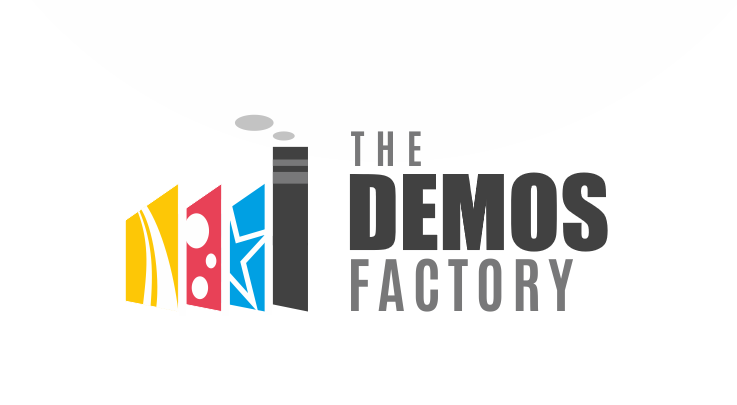

## What is Demos Factory

Hello, welcome to Demos Factory, a repository where you will find some cool demos to learn and use cutting-edge Microsoft related technologies such as Azure, Windows 10, Bot Framework, Cognitive Services and many more.

We tried to write very detailed documentation for the demos so anyone can follow it and utilize it in their projects / POCs, however, some of these demos require advanced technical knowledge. 

The scenarios in Demos Factory are not focusing on how complicated or advanced they are from technological perspective, instead we focused on a complete end-to-end business case that demonstrate a use of one or more technology area. 

## The Demos

Currently we have the following demos fully produced from the factory and ready to be followed / used.

 **1. Cognitive Services Showcase:** This cool demo is built based on [Kiosk project](https://github.com/Microsoft/Cognitive-Samples-IntelligentKiosk) . It contain 3 scenarios:

 - FaceLook: Age and Gender Detection 
 - Emotionizer: A simple game to challenge your friend who shows a random emotion better than the other. 
 - SurpriseMe: It detects your gender and age and suggest to you one of Microsoft's products.

**2. Web Apps on Linux using Docker:** Build your own upload center using Docker image using Azure Web Apps on Linux

**3. Open Source DevOps:** Build PHP development environment connected to Azure with full DevOps scenario.

**4. How Old Bot:** Building a bot that is connected to Azure Cognitive Services to guess the user age & gender.

## Join the team

So you have cool demos to share, just follow these steps:

#### Do you have previous expirence in GitHub ?
If so, then:
- Use this markdown template to create the README page of your demo.
- Fork this repo.
- Create a new folder for your project, name it carefuly to represent your demo.
- Upload your demo files as per the participation guideline. 
- Create pull request.

That is it, I will review your demo and merge it to this repo and update the main README file.

#### You don't have previous expirence in GitHub or don't prefer to use it.

No issues at all, you can follow these steps:
- Download this Word Document Template and fill it with a description of your demo.
- Upload your demo files in a strctured way to a website or cloud storage (OneDrive, Dropbox ... etc)
- Email the filled templates along with the demo files link to SaudiDX@outlook.com
- Make sure that you always for the participation guideline.

That is it, I will review your demo and upload it to this repo.

## Have a suggestion?

We want to hear your ideas, suggestion or feedback to make this project the best place to find interesting and up to date demos. Please email us at: SaudiDX@outlook.com or contact me on Twitter [@nasser](http://twitter.com/nasser)
