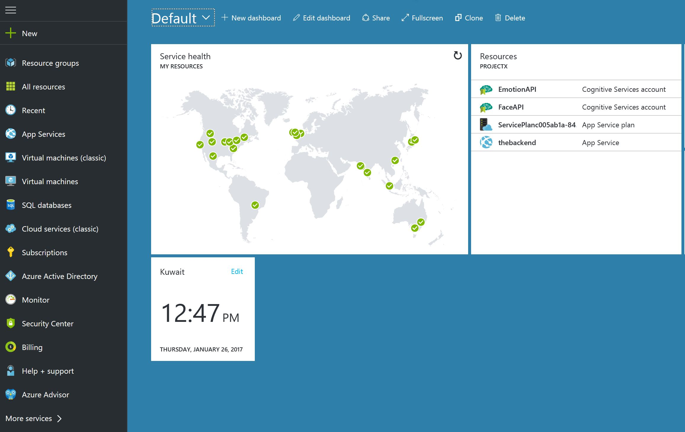
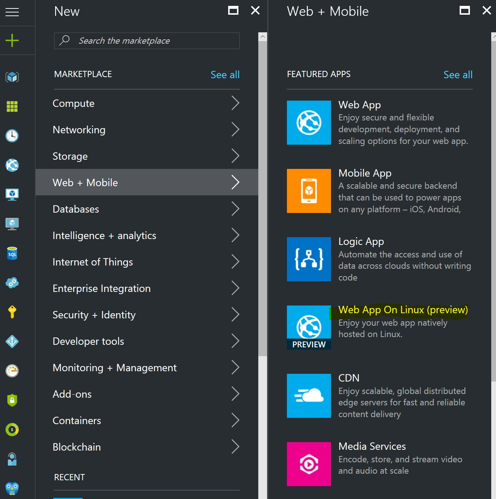
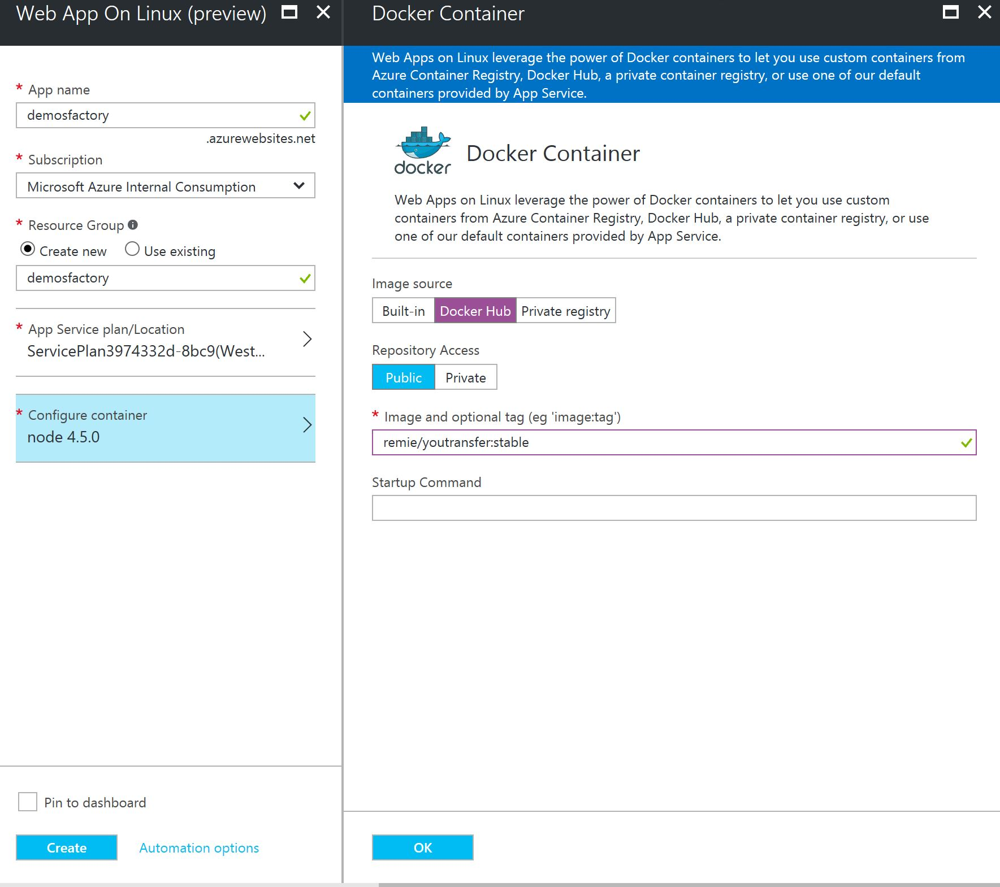
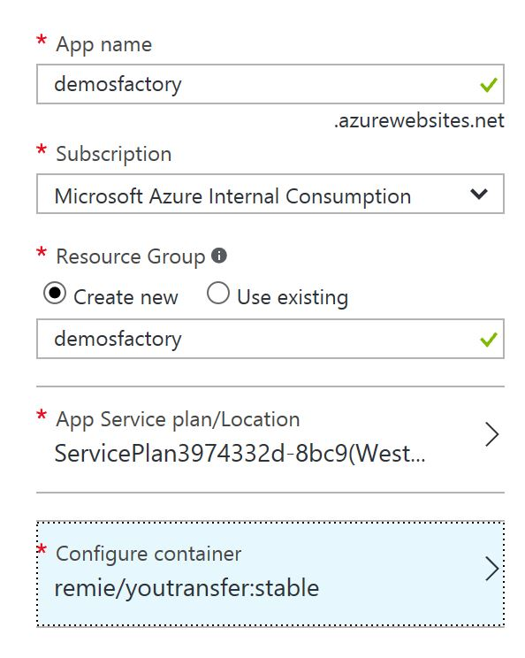
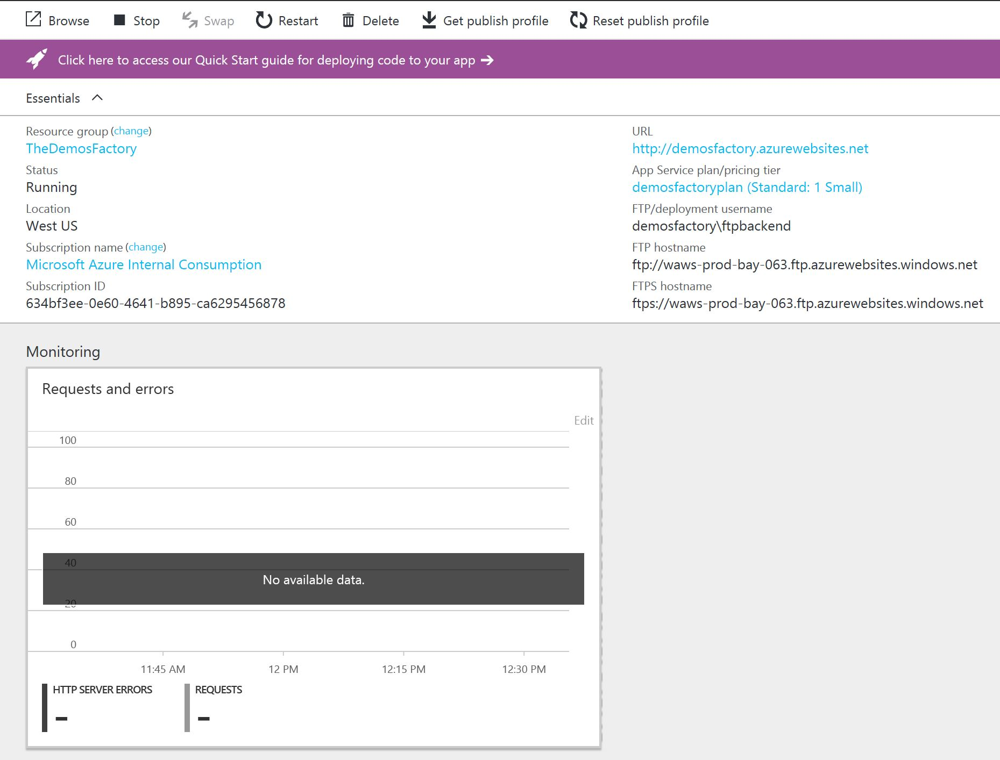
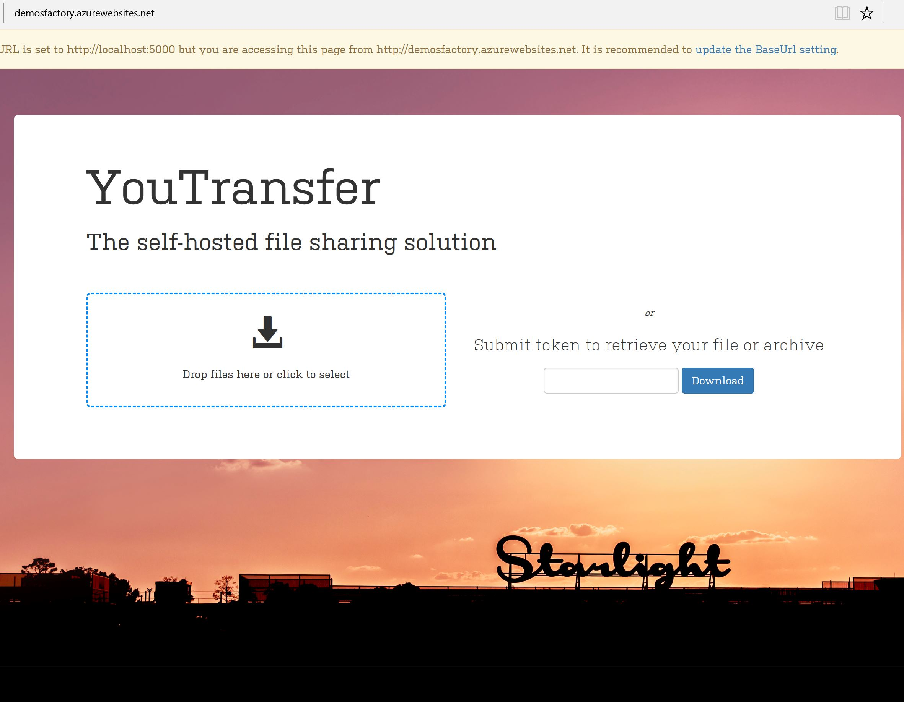

## Build Upload Center using Azure Web Apps on Linux & Docker

This no-code demo is very straight forward and easy to follow, yet powerfull enough to demonstrate the newly introduced Azure Web Apps on Linux. In order to demo this we chose to use a pre-built Node.js App hosted as a Docker container and published on Docker Hub. We chose a very simple and light-weight solution for drag-and-drop file sharing called [YouTransfer](http://www.youtransfer.io/). Let's start deploying this solution:


##### Login to your Azure Portal
Login to [portal.azure.com](http://portal.azure.com) and click on the + sign to add new resouece



##### Create Web Apps on Linux  
Linux developers can now use the very robust and powerfull PaaS offering to create website from Azure. The service still in preview so it might lack many of the equivalent windows-based service. Choose Web Apps on Linux from the menu and continue. 




##### Fill the website details
Now you are creating a website on Linux environment, simply fill the website subdomain, the resource group and then click configure container which will open for you new blade to right.




##### Use YouTransfer from Docker Hub
From this screen you can chose one of the ready containers (Currently PHP, Node.js and .NET Core) or a container image in Docker Hub or a private container registery you might have on your server. For our demo, luckily the solution we want to deploy (YouTransfer) is exist in Docker Hub. Docker Hub can be thought of as a Marketplace for Docker containers. To deploy the solution we want from Docker Hub we just simply put the image name and any opetional tag in this format `image:tag` . The YouTransfer image can be retrieved by:

```
remie/youtransfer:stable 

```



This tells Azure to deploy YouTransfer image from Remie's repo (the name of the developer) and bring only the image that the developer has tagged as `stable`


##### Confirm

Now click ok and confrm that everything has green check beside it as per the following screenshot:




##### Access the website
Once Azure confirm that the deployment succesfully completed, you can access the website and start using your own upload center which you can use personally or share it with the world :)




## Other Resources

To know more about Azure Web Apps on Linux you can access these usefull resources:

- [Create Azure Web Apps on Linux] (https://docs.microsoft.com/en-us/azure/app-service-web/app-service-linux-how-to-create-a-web-app)
- [Docker Hub](https://hub.docker.com/)
- [Hosting Azure Web Apps on Linux](https://buildazure.com/2016/10/19/hosting-azure-web-app-on-linux/)
- [Why Azure Web App on Linux is huge](https://dzone.com/articles/why-azure-web-app-on-linux-is-huge)